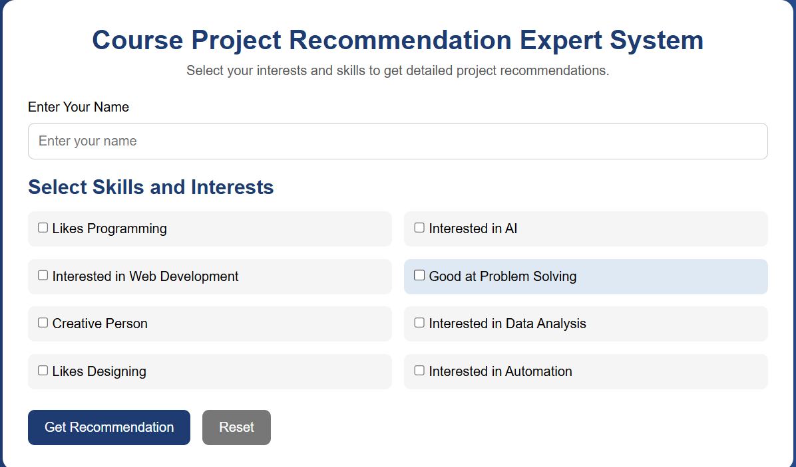

# Knowledge-Based Expert System

## 📌 Project Overview
AI-based system that recommends course projects based on user inputs.

## 🚀 Features
- Rule-based AI system
- IF-THEN logic
- Forward chaining
- Project recommendation engine

## 🧠 AI Concept Used
- Knowledge Representation
- Inference Engine
- Expert System Rules

## Screenshots

### Home Page

---

### Recommendation Output

## 🔗 Live Demo
https://chetanay1636-afk.github.io/course-project-expert-system/

## 👨‍💻 Tech Stack
- HTML
- CSS
- JavaScript
